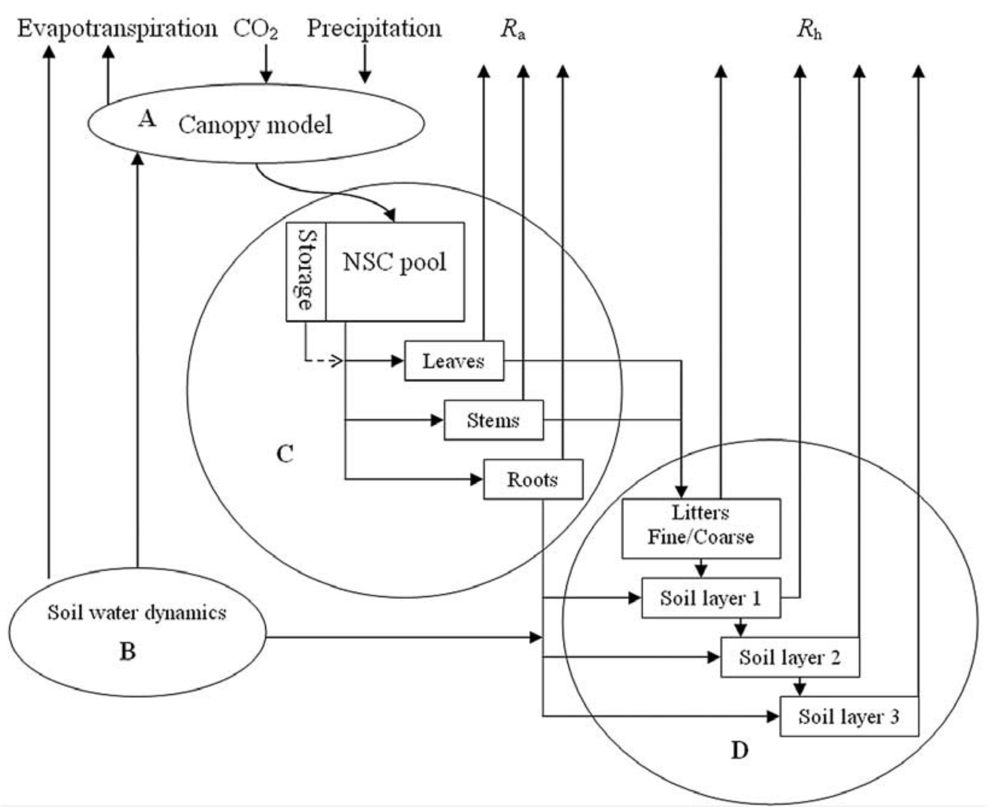

```{r setup, include=FALSE}
knitr::opts_chunk$set(echo = TRUE, fig.pos = "!H", out.extra = "")

library(tidyverse)
library(ggplot2)
library(lubridate)
# library(neonUtilities)
# library(geoNEON)
# library(sp)
# library(httr)
# library(jsonlite)
# # library(dplyr, quietly=T)
# library(downloader)
# library(BiocManager)
# library(rhdf5)

# load("neon_token_source.Rdata")

load("Sec2.15.data.Rdata")

```

# 2.16 Intro to NEON Culmination Activity
*Write up a 1-page summary of a project that you might want to explore using NEON data over the duration of this course. Include:*

A project that I would like to explore using NEON data this semester is comparing the NEON and LTER data at the Sevilleta Wildlife Refuge and explore how best to integrate the different data streams together. For my PhD research, I am trying to constrain a process-based model representing the major ecological processes in four different ecosystem types in the Sevilleta area: a desert grassland, a plains grassland, a desert shrubland, and a juniper savanna. In these four different ecosystem types, LTER experiments have been going on for several years. There are drought experiments (i.e., reducing the total amount of precipitation entering the ecosystem), precipitation variability experiments (i.e., increasing the sporadicity of precipitation entering the ecosystem), and combination experiments with both drought and precipitation variability treatments. These drought and precipitation variability treatments reflect what climatologists anticipate in our future under the new climate regime.

I am planning to use the dryland version of TECO (Hou et al. 2021) as my foundational process-based model, which I will modify to (a) reflect the vegetation structure for each ecosystem type and (b) integrate more data streams. See schematic of the basic TECO model on the next page.



Once we have successfully constrained the model using data from the different LTER experiments (and NEON data), we can project into the future to make inferences about how these four different ecosystem types will be impacted by the different potential climate regimes (e.g., more drought and more sporadic precipitation). 

For this semester, I want to focus on exploring what data products from both NEON and LTER best match the various parameters that need to be constrained in the dryland version of TECO (figure on next page). For example, what data product can be used to best estimate the carbon pool in leaves through time? Most likely there will be overlap between NEON and LTER data products for certain carbon pools (boxes in the TECO diagram on next page) or flux equations (arrows in the TECO diagram on next page), in which case I need to explore if it is feasible to integrate the two data products into one even better data product (or perhaps assess which product is "better" and disregard the other product).


## Question 1
**the types of NEON (and other data) that you will need to implement this project, including data product id numbers.**

I would like to explore a lot of NEON data products, including (but not limited to)

1) H2O Concentration (DP1.00035) in the air around the top of the NEON tower. This is important for estimating water vapor exchange and ET (evapotranspiration).
2) CO2 Concentration (DP1.00034) in the air around the top of the NEON tower. This is important for estimating carbon exchange between the atmosphere and ecosystem.
3) Precipitation (DP1.00006.001), which is important data because it effects water cycle dynamics throughout the whole model.
4) Coarse downed wood log survey (DP1.10010.001) to inform litter estimates.


## Question 2
**If in your NEON coding lab part 2 you highlighted challenges to using these data, discuss methods to address those challenges. e.g. If your site doesn’t yet have a long data record, is it located close to a longer lived site from another network? (LTER, Ameriflux, LTAR etc)**

In my NEON coding lab part 2, I discussed the challenge of downloading large files. My computer kept crashing when I was trying to download the bundled eddy co-variance data because I didn't have enough memory on my computer.

To address the issue of downloading huge files, I could either break up the download into multiple chunks (perhaps my time intervals) or try to download all the data all at once on a more powerful computer than my laptop. I could even use a super computer (like Monsoon) to download all the data at once for me. Whether in the future I choose to download the data in chunks or download the data all at once on a super computer, I will make clear comments in my code about why I am doing what and how I am accomplishing the overall data download needed to replicate my work.


## Question 3
**One high-level summary graphic including all of your data from the NEON Coding Lab Part 2**
```{r}

# fix the precip date
precip.df = precip.df %>%
  select(-Date1) %>%
  mutate(
    timestamp = ymd_hms(endDateTime)
  )

## combine the separate df's by date
df = H2Oconc.df %>%
  # combine the two eddy co-var data products
  left_join(CO2conc.df, by = "timeEnd") %>%
  # round the date/time to be at clean 30 min marks
  mutate(
    # make the date column a "lubridate" column
    timestamp = ymd_hms(timeEnd),
    # round the date the nearest 30 min mark
    timestamp = round_date(timestamp, "30 minutes")) %>%
  # add in the precip data
  left_join(precip.df, by = "timestamp") %>%
  # get rid of any rows with NA's 
  na.omit() %>%
  # get rid of the extra date columns
  select(-endDateTime, -timeEnd)


## reformat the data for graphing purposes
df = df %>%
  # scale/center the variables for plotting purposes
  mutate(
    Precipitation = scale(TFPrecipBulk),
    H2O_Concentration = scale(data.fluxH2o.turb.flux),
    CO2_Concentration = scale(data.fluxCo2.turb.flux)
  ) %>%
  # get rid of the unscaled columns
  select(-TFPrecipBulk, -data.fluxH2o.turb.flux, -data.fluxCo2.turb.flux) %>%
  # rearrange the columns
  select(timestamp, everything()) %>%
  # convert the df to "long" format
  pivot_longer(cols = 2:ncol(df), names_to = "ScaledVariable", values_to = "Value")


df %>% ggplot() +
  geom_line(aes(x = timestamp, y = Value, color = ScaledVariable)) +
  scale_color_manual(values = c("forestgreen", "cyan2", "blue")) +
  labs(title = "JORN Timeseries", x = "Month (2021)", y = "Scaled & Centered Value", color = "Scaled & Centered Variable") +
  theme(plot.title = element_text(hjust = .5))

```

